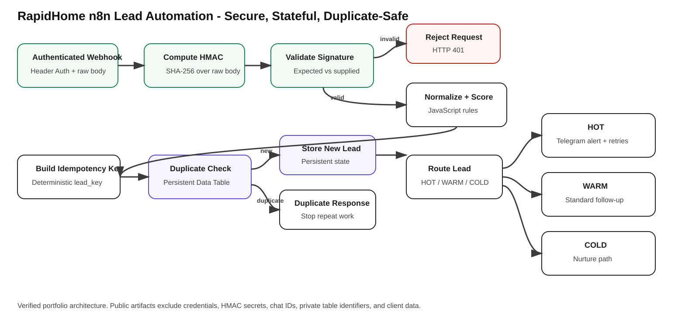

# RapidHome Lead Automation - n8n

A production-minded n8n lead intake and response workflow for home-service businesses. RapidHome accepts inbound leads, protects the webhook, prevents duplicate processing, scores and routes leads, alerts on urgent opportunities, and returns structured API responses.

## Highlights

- Authenticated POST webhook using n8n Header Auth.
- Raw-body HMAC-SHA256 signature verification before lead processing.
- Explicit rejection of invalid signatures with HTTP 401.
- Deterministic `lead_key` generation for idempotency.
- Persistent lead storage with n8n Data Tables.
- Duplicate detection so repeated webhook deliveries do not create duplicate records or trigger repeat processing.
- JavaScript normalization and deterministic lead scoring.
- HOT / WARM / COLD routing.
- Immediate Telegram alerting for HOT leads.
- Retry and failure handling for notification delivery.
- Structured webhook responses for success, duplicate, authorization failure, and downstream notification failure.

> The qualification logic in the current build is deterministic and rule-based. It does not claim to use an LLM. AI-assisted qualification can be added as a separate extension when a business use case justifies it.

## Architecture



The security and reliability path is:

```text
Authenticated Webhook
        |
        v
HMAC-SHA256 over raw request body
        |
        v
Signature validation
   | valid        | invalid
   v              v
Normalize      HTTP 401
+ score
   |
   v
Deterministic lead key
   |
   v
Persistent duplicate check
   | new          | duplicate
   v              v
Store lead     Duplicate response
   |
   v
HOT / WARM / COLD routing
```

## Verified behavior

The current build has been tested end-to-end.

| Scenario | Expected result | Verified |
| --- | --- | --- |
| Missing/incorrect Header Auth | Request blocked before workflow processing | Yes - HTTP 403 |
| Correct Header Auth + invalid HMAC | Request rejected before lead processing | Yes - HTTP 401 |
| Correct Header Auth + valid HMAC | Request allowed into the workflow | Yes |
| First valid lead | Stored once and routed | Yes |
| Same valid lead submitted again | Duplicate response, no second data-table row | Yes |
| HOT lead | Priority Telegram alert path | Yes |
| WARM lead | Standard follow-up path | Yes |
| COLD lead | Nurture path | Yes |
| Telegram delivery failure | Retry/failure path and structured error response | Yes |

## Idempotency

RapidHome derives a deterministic `lead_key` from normalized lead attributes. Before downstream processing, the workflow checks the persistent `rapidhhome_leads` data table.

If a matching key already exists, the workflow stops repeat processing and returns a duplicate response. This protects against duplicate webhook deliveries and client retries.

Example duplicate response:

```json
{
  "status": "duplicate",
  "message": "Lead has already been processed",
  "lead_key": "lead:example@example.com|15550123456|example customer|hvac maintenance|2026-09-25"
}
```

## Webhook security

RapidHome uses two separate controls:

1. **Header authentication** gates access to the webhook.
2. **HMAC-SHA256 payload verification** validates that the request body matches the signature supplied by the sender.

The HMAC is calculated over the raw request body rather than a re-serialized JSON object. The public repository does not contain either secret.

See [SECURITY_AND_TESTING.md](SECURITY_AND_TESTING.md) for the validation matrix and security notes.

## Example lead payload

```json
{
  "name": "Michael Brown",
  "email": "michael@example.com",
  "phone": "+1 555 018 7744",
  "service": "HVAC Repair",
  "description": "Our AC has completely stopped cooling and we need someone urgently today.",
  "preferred_date": "2026-09-22"
}
```

## Public workflow export

`RapidHome_n8n_Public_Demo.json` is a sanitized baseline export with credentials and private identifiers removed. The live portfolio build has since been extended with authenticated webhook intake, HMAC verification, persistent idempotency, and duplicate-safe processing.

A refreshed advanced export should only replace the public JSON after all credentials, table identifiers, chat IDs, instance IDs, and private values have been sanitized.

## Security hygiene

Never commit:

- Header Auth secrets
- HMAC signing secrets
- Telegram bot tokens
- Telegram chat IDs
- n8n credential references
- private n8n instance or workflow identifiers
- production client data

## Skills demonstrated

n8n · Workflow Automation · JavaScript · Webhooks · HMAC-SHA256 · API Security · Idempotency · Persistent State · Data Tables · Conditional Routing · Error Handling · Retry Logic · Telegram Integration · Structured API Responses

## Portfolio

Built by **Victor Bello**.

LinkedIn: https://www.linkedin.com/in/victor-bello-az
